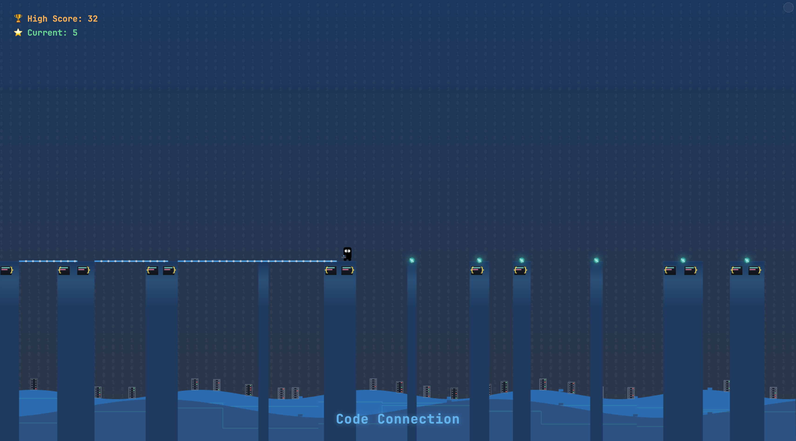

# Code Connection

A developer-themed platform game where you connect code blocks by building bridges between platforms. This is a re-themed version of the classic "Stick Hero" game concept.



## How to Play

1. **Objective**: Help your developer character traverse platforms by creating connections (code bridges) between them. Score points by making successful connections and try to achieve the highest score!

2. **Controls**:

   - **Click/Tap and hold**: To extend a connection (build code)
   - **Release**: To deploy the connection

3. **Scoring**:
   - Basic connection: 1 point
   - Perfect connection (hitting the target area): 2 points
   - Consecutive perfect connections: Increasing multiplier for bonus points

## Game Features

- **Developer Character**: A programmer with glasses, headphones, and a laptop
- **Code-Themed Platforms**: Platforms styled as code blocks with syntax elements
- **Tech Environment**: Binary pattern background with circuit-like hills and server racks
- **Debug Mode**: Toggle debug mode to:
  - View distances and perfect hit spots
  - Get larger target areas
  - See helpful guidelines for perfect hits
  - Monitor game state in real-time

## Development Notes

This game is built with pure HTML5, CSS3, and JavaScript with no external dependencies. It uses a canvas element for the game rendering.

### Credits

- Original game concept based on the work by Hunor Marton Borbely
- Retheming and additional features by Romain C.

## Future Improvements

Potential improvements for the future:

- Add sound effects (keyboard typing, deployment sounds)
- Add different levels with different themes
- Add powerups (coffee boost, debugging tools?)

---

Enjoy the game! Feel free to contribute to the project by submitting issues or pull requests.

# Character Animation Showcase

This project provides a visual reference for the character animations used in the stick hero game. It allows you to view and interact with all the different character states in a clean, isolated environment.

## Files

- `character-reference.js` - The core JavaScript file containing all character animation code
- `character-showcase.html` - A simple page showing all character animations side by side
- `character-showcase-interactive.html` - An interactive version with controls for customization

## How to Use

1. Open either of the HTML files in a web browser
2. The basic showcase displays all animations side by side
3. The interactive showcase provides additional features:
   - Select different animations using buttons or cards
   - Adjust scale to see details
   - Change animation speed
   - Customize background color
   - Toggle grid for precise positioning
   - Play all animations in sequence

## Character States

The character has five different states/animations:

1. **Waiting** - Standing with laptop in left hand
2. **Coding** - Sitting with laptop open, animated code lines
3. **Deploying** - Sitting with laptop open, static code lines
4. **Running** - Moving with laptop tucked under right arm
5. **Crashing** - Falling with laptop above head

## Using in Your Projects

To use these animations in your own projects:

1. Include the `character-reference.js` file in your project
2. Create a canvas element in your HTML
3. Call the `drawCharacter()` function with the appropriate parameters:

   ```javascript
   // Example usage:
   const canvas = document.getElementById("game");
   const ctx = canvas.getContext("2d");

   // Draw character in waiting state
   drawCharacter(ctx, "waiting", 100, 0, 375, 100);

   // For animation, use requestAnimationFrame and update as needed
   ```

## Customization

The character design can be customized by modifying the colors and dimensions in the `character-reference.js` file. The color palette is defined at the bottom of the file.

## Credits

Character animations designed for a stick hero game, inspired by developer-themed characters.
